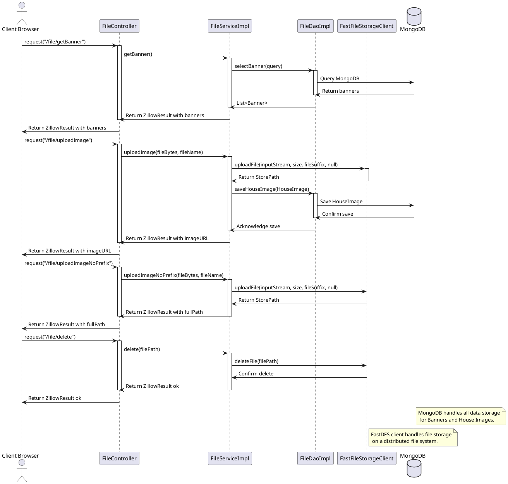
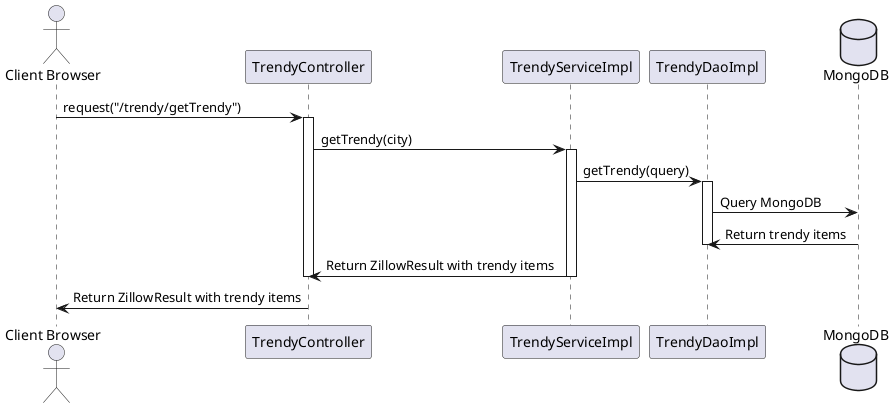
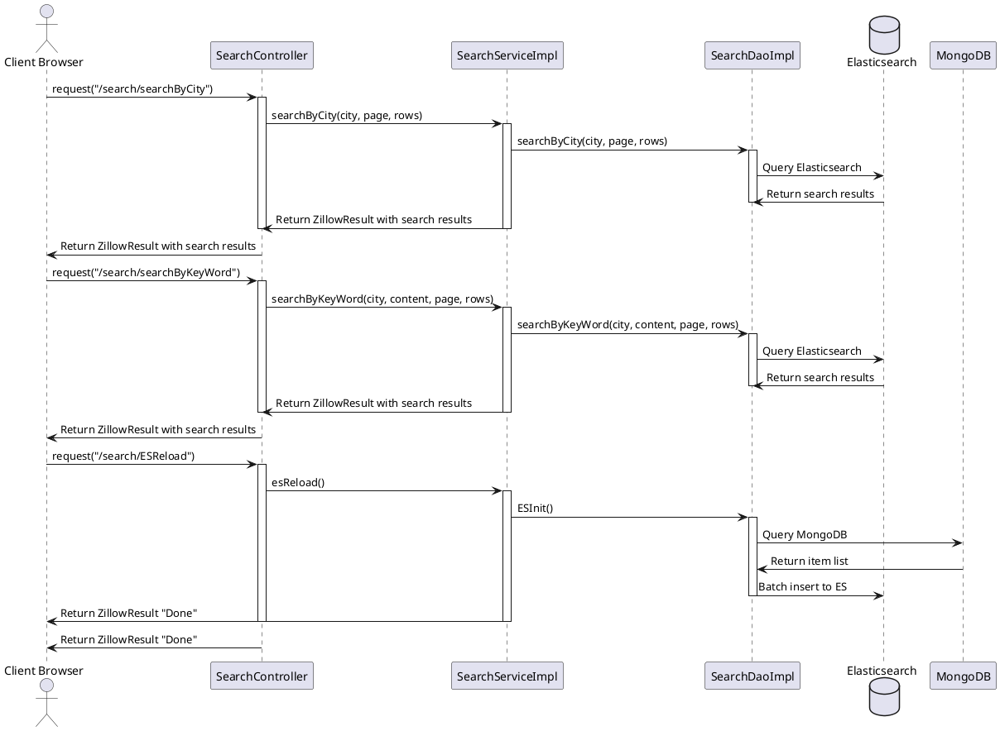
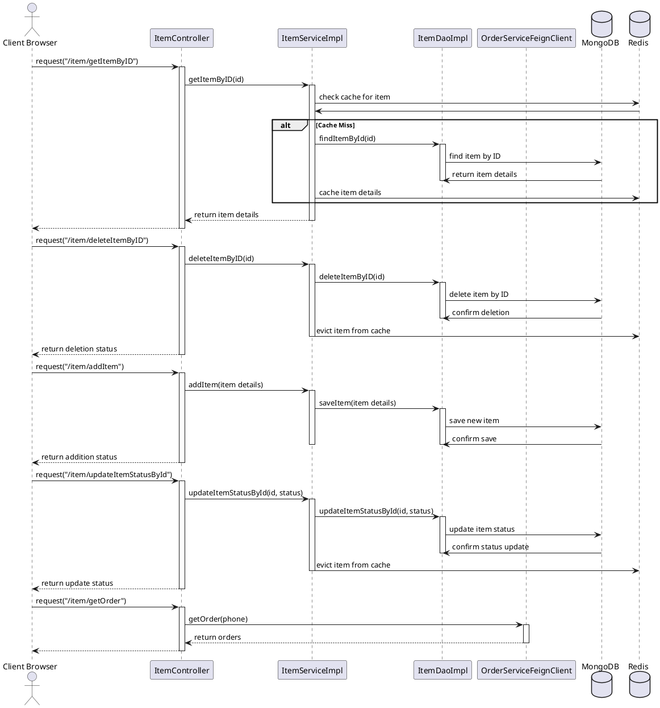
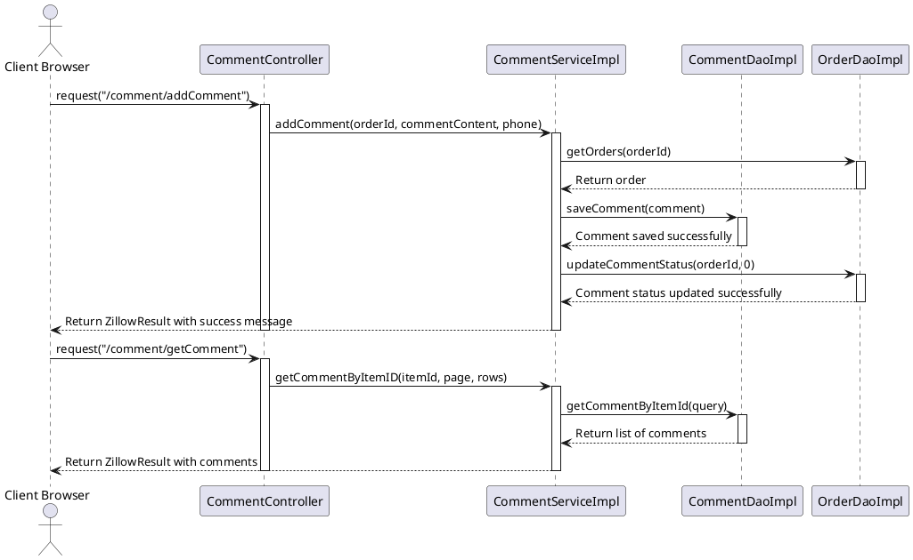
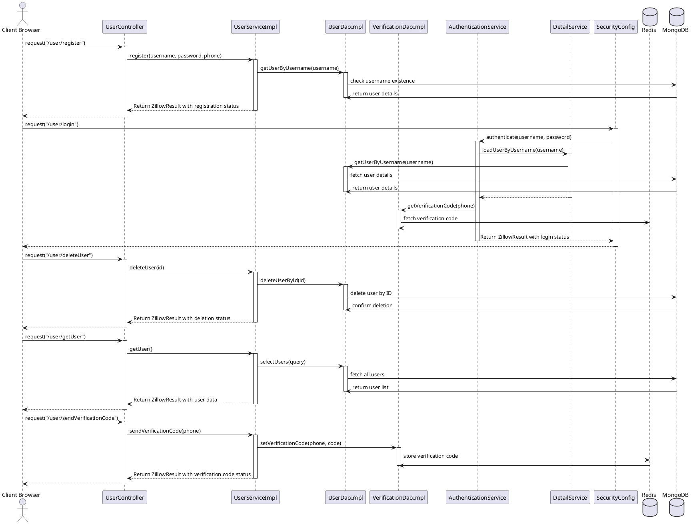
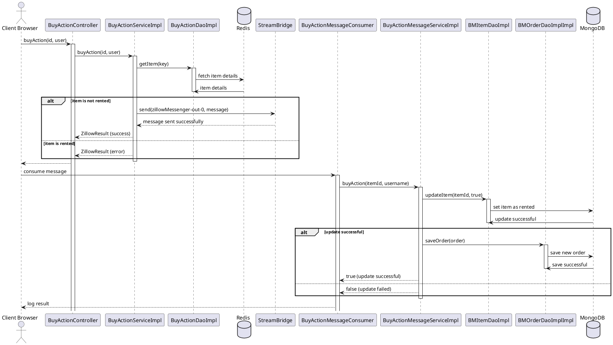
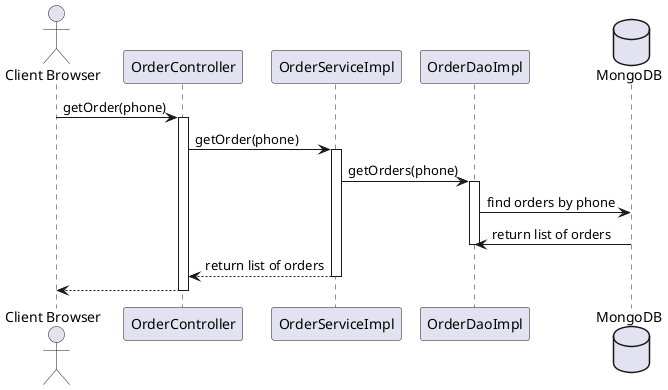

# Zillow

## Sequence Diagram

#### Zillow-File

#### Zillow-Trendy

#### Zillow-Search

#### Zillow-Item

#### Zillow-Comment

#### Zillow-User

#### Zillow-BuyAction

#### Zillow-BuyAction
